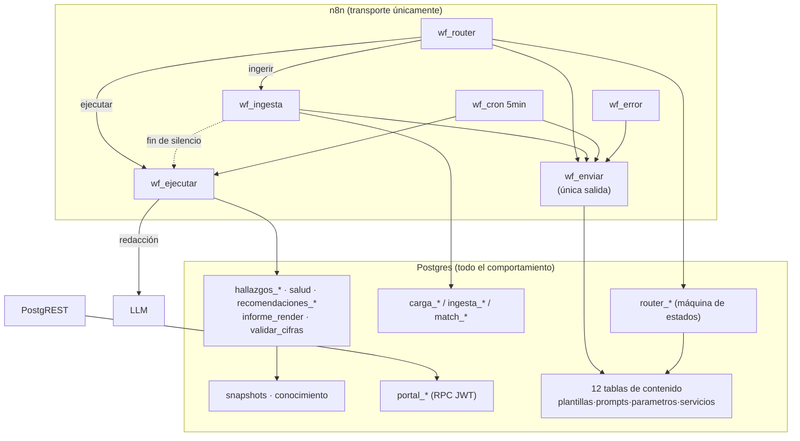

# Componentes internos

Componente = agrupación funcional de objetos SQL y/o workflows (no es un
servicio desplegable). Versión extensa con etiquetas de evidencia:
`../../agent-context/history/auditorias/2026-08-19/architecture/components.md`. Mapa función→archivo:
[`../generated/symbols.json`](../generated/symbols.json).

| # | Componente | Implementación canónica | Domains |
|---|---|---|---|
| C1 | Canal de entrada | `bin/gen_wf_router.py`, `bin/gen_wf_wa_router.py`; `usuario_de_canal`, `router_marcar_editables` | DOMAIN-CANALES, DOMAIN-CONVERSACION |
| C2 | Router (máquina de estados) | `router_procesar_mensaje` + `router_ctx` + 5 `router_h_*` + `router_respuesta` | DOMAIN-CONVERSACION |
| C3 | Presentación | `resolver_plantilla`, `teclado_*`, `esc_html`, `miles`… ; tabla `plantillas` (82); `wf_enviar` (49 nodos) | DOMAIN-CANALES |
| C4 | Carga y panel | `carga_evaluar` (árbitro con advisory lock), `carga_panel/_resumen/_arrancar/_hay_con_que`; columnas de `sesiones` | DOMAIN-INGESTA |
| C5 | Ingesta | 22 `ingesta_*`; tablas `documentos`, `formatos_documento`, `sinonimos_columna`; `wf_ingesta` (34 nodos) | DOMAIN-INGESTA |
| C6 | Matching | `match_resolver_documento/producto`, `match_confirmar_alias`, `norm_texto`; `productos`, `alias`, `v_calidad_matching` | DOMAIN-INGESTA |
| C7 | Análisis | `ejecucion_preparar/cerrar`; despacho por `servicios.funcion_hallazgos` → `hallazgos_generar` / `hallazgos_compras` / `contexto_negocio_recuperar`; `salud_negocio`, `recomendaciones_negocio`, `informe_render`, `informe_estructura_seca`, `validar_cifras`; `wf_ejecutar` (29 nodos) | DOMAIN-INTELIGENCIA |
| C8 | Memoria | `snapshot_tomar/anterior/umbrales`; `recomendaciones_registrar/medir/vigentes`, `recomendacion_accion/marcar_cierre/metrica_valor/objeto_evaluable`; `conocimiento_*` | DOMAIN-INTELIGENCIA, DOMAIN-RECOMENDACIONES |
| C9 | Consulta | `consulta_iniciar`, `intencion_detectar/resolver/agregados`, `periodo_resolver`, `perfil_negocio` | DOMAIN-CONVERSACION, DOMAIN-INTELIGENCIA |
| C10 | Proactividad | `mantenimiento_ciclo` → reaper + expiración + `alertas_evaluar` + `informes_periodicos_disparar`; vistas `v_negocios_alertables/_informe_periodico`; `wf_cron` (6 nodos) | DOMAIN-PROACTIVIDAD |
| C11 | Portal | 32 `portal_*` (28 expuestas: 2 a `portal_anon`, 27 a `portal_usuario`); `jwt_firmar`, `portal_claim/negocio/token_crear`; `portal/publico/*.html` sin build | DOMAIN-PORTAL |
| C12 | Errores | `wf_error` (errorWorkflow de los otros 6): INSERT en `fallas` (SQL literal en nodo), clasificación transitoria por regex JS | DOMAIN-CANALES |

## Dos despachos invisibles al análisis estático `[CONFIRMADO]`

1. **Despacho por filas**: `ejecucion_preparar` hace
   `EXECUTE format('SELECT %I($1,$2)', servicios.funcion_hallazgos)`. Cambiar el
   servicio es un `INSERT` en `servicios`. `db/actual/grafo.json` ya resuelve
   esta arista leyendo la tabla.
2. **Plantillas por clave compuesta**: claves como `ejecucion.entregada.` ||
   servicio se componen en runtime (`plantilla_cuerpo_srv`, `ejecucion_cerrar`).
   Un grep de la clave literal no encuentra sus lectores.

## Diagrama

Espejo canónico: [`diagrams/components.mmd`](diagrams/components.mmd).

