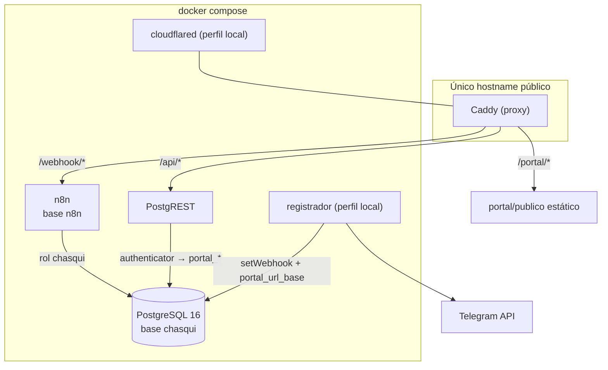

# Contenedores

Servicios desplegables (`docker-compose.yml`). Evidencia: `docker compose ps` y
compose del repo; detalle en `../../agent-context/history/auditorias/2026-08-19/architecture/architecture.md` §1.

| Contenedor | Imagen | Puerto | Perfil | Rol |
|---|---|---|---|---|
| `postgres` | postgres:16 | 127.0.0.1:5432 | siempre | **el sistema**: base `chasqui` (esquema+producto+datos) |
| `n8n` | n8nio/n8n:2.31.5 | 127.0.0.1:5678 | siempre | runtime de los 7 workflows; base `n8n` separada (credenciales, ejecuciones) |
| `postgrest` | postgrest v12.2.x | interno :3000 | siempre | publica RPC `portal_*`; roles `authenticator`/`portal_anon`/`portal_usuario` sin permisos sobre tablas (`PORTAL-001`) |
| `proxy` | caddy:2-alpine | 127.0.0.1:8080→80 | siempre | única puerta pública (`/webhook`, `/api`, `/portal`, resto 404) |
| `cloudflared` | cloudflare/cloudflared | — | `local` | quick tunnel saliente |
| `registrador` | alpine:3.20 | — | `local` | descubre URL del túnel, registra webhook Telegram/WhatsApp, escribe `parametros.portal_url_base` |

**Gotenberg no existe en el compose** (`PRODUCTO-002`). La columna
`ejecuciones.pdf` sobrevive vacía.

## Dos bases lógicas, una instancia

- `chasqui`: todo el producto y el negocio. La herramienta entera es esta base
  (`bash bin/respaldo.sh`).
- `n8n`: runtime. Los workflows se importan desde el repo
  (`bin/importar-workflows.sh` importa + publica + activa); las credenciales
  (`chasquiDs0000000001` = API key LLM) viven sólo ahí.

## Configuración que gobierna el runtime `[CONFIRMADO]`

| Variable | Valor | Consecuencia |
|---|---|---|
| `N8N_CONCURRENCY_PRODUCTION_LIMIT` | 5 | freno de estampida en cargas masivas |
| `EXECUTIONS_TIMEOUT` | 300 s | techo duro por ejecución (ver DOMAIN-INTELIGENCIA §presupuesto) |
| `EXECUTIONS_DATA_SAVE_ON_SUCCESS` | none | éxito no deja rastro en n8n; sólo errores (podados a 7 días) |
| `N8N_DEFAULT_BINARY_DATA_MODE` | filesystem | binarios transitorios al volumen |
| `PGRST_DB_MAX_ROWS` | 1000 | tope del portal |
| `PGRST_OPENAPI_MODE` | disabled | PostgREST no publica su esquema |

## Diagrama

Espejo canónico: [`diagrams/containers.mmd`](diagrams/containers.mmd).

