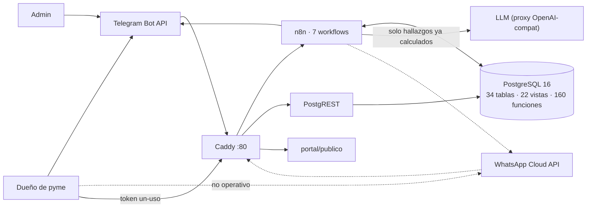

# Contexto del sistema

Actores, sistemas externos y frontera. Detalle ampliado con estado observado de
la instalación: `../../agent-context/history/auditorias/2026-08-19/architecture/context.md` (auditoría 2026-08-19).

## Qué es (según el código)

Bot de mensajería que recibe archivos de ventas/compras de una pyme, los
normaliza en Postgres, calcula diagnósticos y recomendaciones **con SQL**, y usa
un LLM **sólo para redactar**. Entrega en chat y portal; nunca PDF
(`PRODUCTO-002`). No es un ERP (`CORE-004`): cotizador y cartera existen pero
están congelados para inversión.

## Actores `[CONFIRMADO]`

| Actor | Canal | Puede |
|---|---|---|
| Dueño de pyme | Telegram | archivos, `/nueva`, `/listo`, `/cancelar`, `/saber`, `/plan`, `/portal`, texto libre, botones `rec:`/`svc:`/`mod:` |
| Admin (`usuarios.rol='admin'`) | mismo bot | además `/salud /embudo /fallas /consumo /matching /pendientes` → `admin_reporte` |
| Usuario del portal | enlace token un-uso (15 min) → JWT 12 h | las 27 funciones `portal_*`; negocio desde el JWT |
| Cliente de cotización | URL pública con token | sólo `portal_cotizacion_publica` |

Sin registro web ni contraseñas: la identidad es la del canal
(`usuario_de_canal`). En esta instalación no hay ningún usuario `admin`
(aviso de fallas no llega a nadie — agent-context/reference/seguridad.md §2).

## Sistemas externos

| Sistema | Dirección | Estado real |
|---|---|---|
| Telegram Bot API | entra/sale | operativo; salida rechazando `Forbidden` desde 2026-08-19 (A-12) |
| WhatsApp Cloud API v23 | entra/sale | workflow activo pero **no operativo**: `WA_PHONE_NUMBER_ID` vacío ⇒ URLs sin id y filtro saltado |
| LLM (proxy OpenAI-compatible) | sale | `DEEPSEEK_BASE_URL`=proxy Google; modelo en filas `prompts.modelo` (D-007) |
| Cloudflare quick tunnel + registrador | entra | descubre URL, registra webhook, escribe `parametros.portal_url_base` |
| DIAN / Wompi | ninguna integración | se parsean XML que el usuario manda; cobro = sólo enlace si existiera fila `pago_enlace` (no existe) |

## Frontera `[CONFIRMADO]`

Un solo hostname público vía Caddy (`portal/Caddyfile`):
`/webhook/*`→n8n · `/api/*`→PostgREST · `/portal/*`→HTML estático · resto 404
seco. Postgres (`127.0.0.1:5432`) y editor n8n (`127.0.0.1:5678`) no están en
internet.

## Diagrama

Espejo canónico: [`diagrams/context.mmd`](diagrams/context.mmd).

