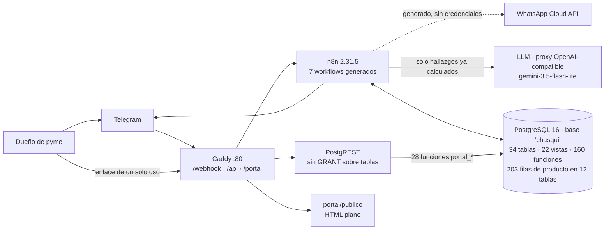

# Documentación de Chasqui

Punto de entrada de la documentación técnica. Producto de una **auditoría de
ingeniería inversa** hecha el **2026-08-19** contra el código, el catálogo vivo
de Postgres y el estado real de la instalación.

> **Qué es y qué no es.** Esto describe **cómo funciona Chasqui hoy**, no cómo
> debería funcionar. Lo normativo vive en `decisiones/` y en `AGENTS.md`; si
> algo de aquí los contradice, mandan ellos y esto está mal. Si algo de aquí
> contradice a `db/actual/`, manda `db/actual/`.

Etiquetas usadas en todo el árbol:

| Etiqueta | Significa |
|---|---|
| `[CONFIRMADO]` | se comprobó ejecutando o leyendo el artefacto que manda |
| `[INFERIDO]` | deducción del autor a partir de evidencia; puede estar mal |
| `[NO DETERMINADO]` | no se pudo establecer, y se dice qué falta |
| `[CONTRADICCIÓN]` | la documentación existente dice otra cosa que el código |

---

## Qué es Chasqui

`[CONFIRMADO]` Una plataforma de **inteligencia y asistencia empresarial para
pymes**, no un ERP. El usuario manda por Telegram los archivos que ya tiene
—facturas electrónicas DIAN, exportaciones de su POS— y recibe en el chat un
diagnóstico con cifras, problemas priorizados y qué hacer con cada uno.

El ciclo declarado es **detectar → explicar → cuantificar → recomendar →
ejecutar**. Los cuatro primeros están implementados. El quinto existe como
*registrar la decisión y medir su efecto*, no como actuar sobre sistemas
externos (ver `domains/recommendations.md`).

## Propósito actual del sistema

`[CONFIRMADO]` El estado del 2026-08-19 es **v0 instalado, en prueba de
usuario**: un negocio real, 101 documentos, 37.454 movimientos, y **cero
análisis completados**. El sistema está en la fase de descubrir por qué.
`docs/auditoria_2026-08-19.md` es la orden de trabajo de ese incidente.

## Arquitectura resumida

`[CONFIRMADO]` Cuatro servicios y una tesis:

> **Postgres es el sistema; n8n sólo transporta.**
> Lo determinístico —parseo, normalización, matching, cálculo, máquina de
> estados, reglas, textos, botones, umbrales, prompts— vive en filas y funciones
> de Postgres. n8n hace lo que Postgres no puede: HTTP, descargar archivos,
> reintentos con backoff.



## Componentes principales

| Componente | Dónde vive | Detalle |
|---|---|---|
| Canal de entrada | `wf_router`, `wf_wa_router` | `architecture/components.md` C1 |
| Router (máquina de estados) | `router_procesar_mensaje` + 5 handlers | C2, `domains/conversations.md` |
| Presentación | `resolver_plantilla` + 82 plantillas + `wf_enviar` | C3, `domains/channels.md` |
| Carga y panel | `carga_evaluar` y 6 funciones más | C4, `domains/ingestion.md` |
| Ingesta | `wf_ingesta` + 22 funciones `ingesta_*` | C5, `domains/ingestion.md` |
| Matching | `match_resolver_*` + `alias` | C6 |
| Análisis | `wf_ejecutar` + `hallazgos_*` + `informe_render` | C7, `domains/intelligence.md` |
| Memoria | snapshots, recomendaciones, conocimiento | C8, `memory-and-state.md` |
| Consulta | `consulta_iniciar` + `intencion_*` | C9, `domains/conversations.md` |
| Proactividad | `wf_cron` + `mantenimiento_ciclo` | C10 |
| Portal | PostgREST + 28 funciones `portal_*` | C11, `interfaces/api.md` |
| Errores | `wf_error` + `fallas` | C12 |

## Dominios

| Dominio | ¿Existe? | Dónde |
|---|---|---|
| Ingestión | sí | `domains/ingestion.md` |
| Productos | sí, **como efecto del matching** (no hay ABM de productos) | `domains/ingestion.md`, `data/data-model.md` |
| Compras | sí (DIAN + tabulares tipo `compra`) | `domains/ingestion.md` |
| Ventas | sí (tabulares tipo `venta`) | idem |
| Inventario | sí, **derivado**; el conteo declarado sólo entra por el portal | `data/data-model.md`, regla R4/R5 |
| Proveedores | **parcial y duplicado**: texto libre en `raw` para las reglas, `terceros` para la cartera | `unknowns-and-discrepancies.md` DUP-2 |
| Inteligencia | sí | `domains/intelligence.md` |
| Hallazgos | sí | `business-rules.md` |
| Recomendaciones | sí, con ciclo de vida completo | `domains/recommendations.md` |
| Informes | sí, en chat; **nunca PDF** | `domains/intelligence.md` |
| Conversación | sí | `domains/conversations.md` |
| Canales | Telegram sí; WhatsApp generado y no operativo | `domains/channels.md` |
| Conocimiento / memoria | sí, seis mecanismos distintos | `memory-and-state.md` |
| **Ejecución de acciones** | **no existe** como acción sobre sistemas externos | `domains/recommendations.md` §Ejecución |

## Flujo general de la información

```
archivo o mensaje
   -> canal (wf_router / wf_wa_router)
   -> router_procesar_mensaje  ->  {respuestas[], acciones[]}
        acción 'ingerir'  -> wf_ingesta -> documentos -> movimientos -> productos
        acción 'panel'    -> wf_enviar (un mensaje que se edita)
        acción 'ejecutar' -> wf_ejecutar
              ejecucion_preparar -> hallazgos (SQL calcula TODAS las cifras)
              -> LLM (redacta, no calcula)
              -> informe_render (layout desde plantillas)
              -> validar_cifras (audita contra los hallazgos)
              -> ejecucion_cerrar -> snapshot + recomendaciones + medición
              -> wf_enviar
        acción 'enviar'   -> wf_enviar -> resolver_plantilla -> Telegram
```

## Cómo se ejecuta localmente

```bash
cp .env.example .env                     # secretos y tokens
docker compose --profile local up -d     # + cloudflared y registrador
bash bin/preparar-portal.sh              # roles de PostgREST (superusuario, 1 vez)
bash bin/migrar.sh                       # instala db/base/ si está vacía, luego db/migraciones/
bash bin/importar-workflows.sh           # importa, publica y activa los 7 workflows
docker compose logs registrador --tail 5 # debe decir: ok · portal_url_base = https://…
```

Después, `/start` en el bot crea usuario y negocio solos. **Nunca
`docker compose down`**: sólo `up -d` (`AGENTS.md`).

Para limpiar entre pruebas: `bash bin/limpiar_negocio.sh` y nada más.

## Cómo ejecutar pruebas

```bash
bash bin/pruebas.sh                 # los 7 bancos SQL (todo en ROLLBACK)
python3 bin/prueba_ciclo_vida.py    # E2E de un negocio por las rutas reales
bash bin/verificar.sh --rapido      # invariantes de repo, sin los bancos
```

Detalle, cobertura y huecos en `testing.md`.

---

## Mapa de esta documentación

```
docs/
├── README.md                        <- estás aquí
├── audit-summary.md                 resumen ejecutivo de la auditoría
├── unknowns-and-discrepancies.md    contradicciones, código muerto, ambigüedades
├── business-rules.md                las 11 reglas + prioridad + ingesta + alertas
├── memory-and-state.md              los seis mecanismos de memoria
├── security.md                      autenticación, autorización, aislamiento
├── testing.md                       bancos, E2E, cobertura y huecos
├── traceability.md                  de la documentación al archivo y la función
├── architecture/
│   ├── context.md                   actores, sistemas externos, estado real
│   ├── architecture.md              procesos, llamadas, responsabilidades
│   ├── components.md                12 componentes internos
│   └── diagrams/*.mmd               Mermaid: contexto, arquitectura, componentes
├── domains/
│   ├── ingestion.md                 del archivo a movimientos con producto
│   ├── intelligence.md              del dato al informe entregado
│   ├── recommendations.md           detectar → cerrar → medir
│   ├── conversations.md             router, consulta, conocimiento
│   └── channels.md                  Telegram, WhatsApp, panel
├── data/
│   ├── data-model.md                34 tablas, ERD, índices, rendimiento medido
│   └── business-glossary.md         cada término por lo que hace el código
├── interfaces/
│   ├── api.md                       webhooks, PostgREST, el portal
│   ├── n8n.md                       los 7 workflows, uno por uno
│   └── llm.md                       qué ve y qué no ve el modelo
└── decisions/
    └── architecture-decisions.md    16 decisiones observadas + ausencias
```

## Documentación anterior: qué se salvó y qué conviene saber

Esta auditoría **no borró ni movió nada**. Todos los documentos previos siguen
donde estaban, porque `AGENTS.md`, `README.md` y `bin/configurar-bot.sh` los
referencian y moverlos rompería el contrato del proyecto.

| Documento | Veredicto | Qué hacer |
|---|---|---|
| `AGENTS.md` (raíz) | **vigente y normativo**. Una imprecisión: congela el «cotizador», que está implementado entero | leerlo primero, siempre |
| `decisiones/` | **vigente y normativo**, 18 decisiones | fuente de «cómo debe ser» |
| `decisiones/deuda.md` | **vigente**, 10 entradas, muy útil | no duplicado aquí; se referencia |
| `db/actual/INDICE.md` | **vigente**, generado | el índice de las 160 funciones |
| `docs/auditoria_2026-08-19.md` | **vigente y abierto**: orden de trabajo de 13 hallazgos | esta auditoría lo confirma y lo cuantifica, no lo reemplaza |
| `docs/ROADMAP.md` | **vigente**, corto y correcto | — |
| `docs/GUIA_TRABAJO.md` | **vigente**; una cifra vieja (202 vs 203 filas de contenido) | — |
| `docs/TEST_DATA_GENERATOR.md` | **vigente y útil** (577 líneas) | `testing.md` lo referencia, no lo duplica |
| `docs/WHATSAPP.md` | **vigente**: checklist de activación | — |
| `docs/GUIA_FUNCIONAL.md` | **vigente**: es la vista del usuario final, no la reemplaza una auditoría técnica | — |
| `docs/GUIA_TECNICA.md` | **útil pero desfasada desde la migración 071**: no menciona `carga_evaluar`, `carga_panel` ni el estado `descartado`, es decir, no describe el mecanismo actual de carga y arranque del análisis | usar `architecture/` + `domains/` para lo posterior a la 070; la guía sigue siendo la mejor fuente del *porqué* de lo anterior |
| `docs/TELEGRAM_UX.md` | **parcialmente vieja**: su «fase siguiente» punto 6 (edición de mensajes) ya está implementada desde la 070 | — |
| `README.md` (raíz) | **cuatro errores concretos verificados** (C-1 a C-4 en `unknowns-and-discrepancies.md`) | corregirlos es un cambio pequeño; no se hizo porque esta fase es sólo de comprensión |
| `docs/historico/` | **no gobierna nada** (`AGENTS.md`) | no se leyó para esta auditoría salvo para citar inventarios ya hechos |
| `workflows/fotos/` | **no son fuente de nada** | se ignoraron; se leyeron los generadores |

`[INFERIDO]` **Redundancia real detectada** (no corregida): `README.md`,
`docs/GUIA_TECNICA.md` §2 y §6, `docs/GUIA_TRABAJO.md` §1 y esta documentación
describen los mismos siete workflows y la misma topología cuatro veces. Cada
copia envejece por su cuenta, y hoy las cuatro dicen cosas distintas sobre el
número de workflows y la última migración aplicada. Consolidarlo es una decisión
de producto, no un efecto secundario de una auditoría.
