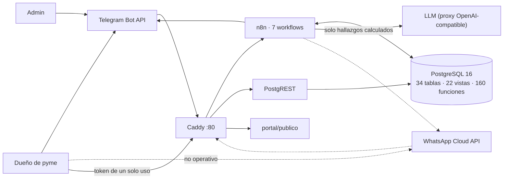

# Contexto del sistema

> Auditoría de ingeniería inversa. Todo lo que sigue está etiquetado:
> `[CONFIRMADO]` sale de ejecutar o leer el artefacto que manda,
> `[INFERIDO]` es deducción del autor, `[NO DETERMINADO]` no se pudo establecer,
> `[CONTRADICCIÓN]` la documentación existente dice otra cosa que el código.
> Fecha de la foto: **2026-08-19**, instalación de esta máquina.

## Qué es Chasqui, según el código

`[CONFIRMADO]` Un bot de mensajería que recibe archivos de ventas y compras de
una pyme, los normaliza en Postgres, calcula diagnósticos y recomendaciones con
SQL, y usa un LLM **solo para redactar** el texto del informe. La entrega es
texto de chat; el detalle largo va a un portal web de una sola página.

Evidencia mínima:

| Afirmación | Dónde se comprueba |
|---|---|
| El comportamiento vive en filas | 203 filas en 12 tablas de contenido (`db/actual/MANIFIESTO.txt`), `resolver_plantilla()` resuelve cada mensaje |
| Postgres calcula | `recomendaciones_negocio()` — 683 líneas de SQL con 11 reglas y sus umbrales leídos de `parametros` |
| El LLM redacta | `prompts.sistema` id 4: «TU TRABAJO ES REDACTAR, NO CALCULAR» + `validar_cifras()` rechaza cifras que no estén en los hallazgos |
| n8n solo transporta | Los 7 generadores en `bin/gen_wf_*.py`: HTTP, descarga de archivos, envío por Telegram |

## Actores

| Actor | Cómo entra | Qué puede hacer `[CONFIRMADO]` |
|---|---|---|
| Dueño de pyme | Telegram | mandar archivos, `/nueva`, `/listo`, `/cancelar`, `/saber <texto>`, `/plan`, `/portal`, preguntar en texto libre, botones `rec:` sobre recomendaciones |
| Admin (`usuarios.rol='admin'`) | Telegram, mismo bot | además: `/salud /embudo /fallas /consumo /matching /pendientes` (`router_h_admin` → `admin_reporte`) |
| Usuario del portal | enlace de un solo uso desde el bot | 27 funciones `portal_*`; el negocio sale del JWT |
| Cliente de una cotización | URL pública con token | `portal_cotizacion_publica(token)`, única función concedida al rol anónimo junto con `portal_sesion_abrir` |

`[CONFIRMADO]` No hay registro por web, ni contraseñas, ni panel de
administración fuera del chat. La identidad es la del canal de mensajería.

## Sistemas externos

| Sistema | Dirección | Estado real hoy |
|---|---|---|
| Telegram Bot API | entrada y salida | **operativo**; ver A-12 abajo |
| WhatsApp Cloud API (Graph v23.0) | entrada y salida | `[CONFIRMADO]` código completo y workflow **activo**, pero `WA_PHONE_NUMBER_ID` vacío en `.env` ⇒ las URLs de envío quedaron horneadas sin id y el `Normalizar` de `wf_wa_router` descarta todo update. **Generado, no funcional.** |
| LLM vía proxy OpenAI-compatible | salida | `DEEPSEEK_BASE_URL=https://generativelanguage.googleapis.com/v1beta/openai`; modelo `gemini-3.5-flash-lite` en los 4 registros activos |
| Cloudflare quick tunnel | entrada | perfil `local`; el servicio `registrador` descubre la URL y la escribe en `parametros.portal_url_base` |
| DIAN | ninguna | `[CONFIRMADO]` Chasqui **lee** XML UBL 2.1 que el usuario le manda. No hay integración con la DIAN: `cartera_facturar_dian()` parsea un archivo, no llama a nada |
| Wompi | ninguna | `[CONFIRMADO]` sólo un enlace de texto si existe `parametros.pago_enlace` para el negocio (`router_plan`). Sin webhook, sin cobro |

## Frontera del sistema

`[CONFIRMADO]` Todo lo público pasa por **un** hostname y por Caddy
(`portal/Caddyfile`): `/webhook/*` → n8n, `/api/*` → PostgREST, `/portal/*` →
HTML estático, y **404 seco** para todo lo demás. Postgres (`5432`) y el editor
de n8n (`5678`) sólo escuchan en `127.0.0.1`.

## Estado observado de la instalación (2026-08-19 ~19:00)

`[CONFIRMADO]`, consultado contra la base viva:

| Métrica | Valor |
|---|---|
| Negocios | 1 (`id=55`, `Mi negocio`, tipo `minimercado`, plan `free`) |
| Usuarios | 1 (`id=52`, rol `operador`, con autorización de datos) |
| Documentos | 101 — 96 `parseado`, 5 `descartado`, 0 `error` |
| Movimientos | 37.454 (2026-03-01 → 2026-07-31) |
| Productos | 65 |
| **Ejecuciones** | **0** — no se completó ni un análisis |
| **Snapshots** | **0** |
| **Recomendaciones persistidas** | **0** |
| Alertas enviadas (registro) | 57, todas regla `margen`, una cada 5 min |
| Fallas | 52 — 51 de `wf_enviar` (`Forbidden` de Telegram), 1 de `wf_ingesta` |
| Migraciones aplicadas | 76 (001–073 selladas por `db/base/002_sellar.sql`, más 074, 075, 076) |

`[INFERIDO]` La instalación está en un estado post-mortem de una prueba de
usuario: los datos entraron, el análisis nunca se produjo y el canal de salida
está rechazando. `docs/auditoria_2026-08-19.md` documenta ese incidente como
orden de trabajo abierta; esta auditoría no lo repite, lo referencia.

## Diagrama

Ver `diagrams/context.mmd`.

