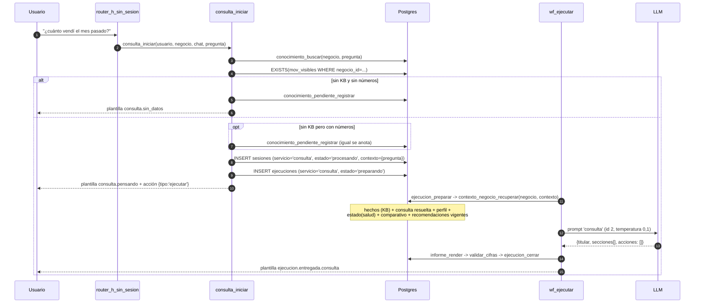

# Dominio: conversación (router, consulta, conocimiento)

## Responsabilidades

Decidir qué contesta el sistema a cada mensaje, mantener el estado de la sesión,
resolver preguntas en lenguaje natural y guardar lo que el dueño enseña.

## La máquina de estados

`[CONFIRMADO]` Estados de `sesiones` y quién los escribe:

| Estado | Se entra por | Se sale por |
|---|---|---|
| `intake` | `/nueva` con más de un servicio de archivos | elegir servicio (`svc:` o texto) → `recibiendo` |
| `recibiendo` | `/nueva` con un solo servicio, `svc:`, o archivo sin sesión | `carga_arrancar` → `procesando`; `/cancelar` → `expirada` |
| `procesando` | `carga_arrancar` (único sitio) | `ejecucion_cerrar` → `completada` / `fallida`; reaper → `fallida` |
| `completada` | `ejecucion_cerrar` con éxito | terminal |
| `fallida` | `ejecucion_cerrar` con error, o reaper | terminal |
| `expirada` | `/cancelar`, `/nueva`, o `mantenimiento_ciclo` a las 24 h sin actividad | terminal |

`[CONFIRMADO]` Hoy hay 3 servicios activos pero sólo **2** con
`entrada='archivos'`, así que `n_serv = 2` y `/nueva` pasa por `intake`.

## Comandos y botones `[CONFIRMADO]`

`router_ctx` parte el texto en `cmd` + `arg`, y reconoce **seis prefijos de
botón** que se tratan como comandos:

| Prefijo | Significado |
|---|---|
| `svc:<codigo>` | elegir servicio |
| `mod:<codigo>` | abrir módulo |
| `modayuda:<codigo>` | ayuda del módulo |
| `tipo:<codigo>` | declarar naturaleza del negocio |
| `rec:<accion>[:<id>]` | acción sobre una recomendación |
| `acepto:<mensaje original>` | consentimiento, **llevándose puesto** el paso interrumpido |

Comandos reconocidos:

| Comando | Handler | Requiere autorización |
|---|---|---|
| `/start`, `/help`, `/ayuda` | `router_h_comandos` → `sistema.bienvenida` | no |
| `/comofunciona`, `/privacidad` | idem | no |
| `mod:`, `modayuda:` | idem | **no** — mirar el menú no entrega datos (`PLANES-001`) |
| `acepto:` / «acepto/si/ok/dale» | idem, marca `autorizacion_datos` | — |
| `tipo:` | idem | sí |
| `rec:*` | idem | sí |
| `/portal`, `/web` | `router_portal` | sí |
| `/plan` | `router_plan` | sí |
| `/saber <texto>` | `conocimiento_guardar(tipo='faq')` | sí |
| `/cancelar`, `/cancel` | cierra la sesión | sí |
| `/nueva` | cierra y abre una nueva | sí |
| `/listo`, `/analizar`, `/fin` | `router_h_recibiendo` | sí |
| `/todos`, `/faltan` | `router_h_recibiendo` — **sin uso**, sólo refrescan el panel; se aceptan por teclados viejos en el historial | sí |
| `/salud /embudo /fallas /consumo /matching /pendientes /admin` | `router_h_admin` → `admin_reporte` | rol `admin`; si no, `sistema.no_entendido` |

`[CONFIRMADO]` El consentimiento es una puerta dura: hasta que
`usuarios.autorizacion_datos` sea true, **todo** lo que no sea informativo o de
menú devuelve `sistema.consentimiento`. Al aceptar con `acepto:<texto>`, el
router **se re-invoca a sí mismo** con el texto original
(`router_procesar_mensaje(evento || {texto: arg})`). No hay recursión infinita
porque la autorización ya quedó en true.

## Menús que se reemplazan `[CONFIRMADO]`

`plantillas.reemplaza` (boolean) marca qué pantallas son de navegación. Si el
update fue un toque de botón (`callback_query`), `wf_router` pasa el
`message_id` a `router_marcar_editables`, que añade `editar: <message_id>` a las
respuestas cuya plantilla tenga `reemplaza=true`. `wf_enviar` entonces usa
`editMessageText` en vez de `sendMessage`.

Plantillas con `reemplaza=true` hoy (14): `mercado.datos_previos`,
`mercado.pedir_facturas`, `recomendacion.detalle`, `recomendacion.lista`,
`recomendacion.sin_pendientes`, `sistema.bienvenida`, `sistema.como_funciona`,
`sistema.consentimiento`, `sistema.elegir_servicio`, `sistema.modulo`,
`sistema.modulo_ayuda`, `sistema.pedir_archivos`, `sistema.pedir_tipo`,
`sistema.privacidad`.

`[CONFIRMADO]` Si editar falla, hay degradación: `EdicionFallo?` descarta el
`"not modified"` (nada que hacer) y manda el resto por la rama de mensaje nuevo.

## Consulta en lenguaje natural

`[CONFIRMADO]` Entra por `router_h_sin_sesion`, **última** condición: texto no
vacío, que no empiece por `/`, que no sea `svc:`, y que exista el servicio
`consulta` activo con `entrada='texto'`.



### Resolución de intención `[CONFIRMADO]`

**No la hace el modelo.** `intencion_detectar(texto)`:

```sql
SELECT codigo FROM intenciones i, q,
  LATERAL (SELECT count(*) n FROM unnest(i.patrones) pa
            WHERE norm_texto(pregunta) LIKE '%'||norm_texto(pa)||'%') m
WHERE i.activo AND m.n > 0
ORDER BY m.n DESC, i.orden LIMIT 1;
```

7 intenciones en filas: `ventas`, `compras`, `gasto_proveedor`, `utilidad`,
`margen`, `costo`, `cobertura`. Cada una declara métrica, periodo por defecto,
filtros aceptados y si compara contra el año pasado.

`intencion_resolver` añade:
- periodo resuelto por `periodo_resolver(texto, defecto, hasta)` — el «hoy» es
  `max(fecha)` de los movimientos, **no** `current_date`;
- filtro de producto y proveedor por `word_similarity > 0,35` (no `similarity`:
  el comentario explica que la pregunta es larga y el nombre corto);
- comparativo, y si la ventana de comparación no tiene movimientos, devuelve
  `sin_datos: true` con una nota, **no** un cero.

`[CONFIRMADO]` Si ninguna intención coincide, `consulta` es `NULL` y el modelo
responde sólo con perfil, salud, KB y recomendaciones vigentes.

## Conocimiento

`[CONFIRMADO]`

| Operación | Cómo |
|---|---|
| Escribir desde el chat | `/saber <texto>` → `conocimiento_guardar(tipo='faq', titulo=primera frase o 80 chars)` |
| Escribir desde el portal | `portal_conocimiento_guardar` (tipos libres; el portal usa `faq` y `precio`) |
| Escribir por acción | `recomendacion_accion('precio')` → `tipo='precio'` |
| Buscar | `conocimiento_buscar(negocio, texto, limite=8, umbral=0,12)` — `similarity` sobre título y contenido, filtrado por `vigente_desde`/`vigente_hasta` |
| Registrar lo que falta | `conocimiento_pendiente_registrar(negocio, pregunta)` — upsert por `pregunta_norm`, incrementa `veces` |
| Ver lo que falta | `portal_pendientes`, vista `v_conocimiento_faltante` (sugiere candidato por `word_similarity ≥ 0,30`) |

`[CONFIRMADO]` En el prompt de consulta, `hechos` **manda sobre todo lo demás**:
«Si la pregunta es por algo de acá, esto manda».

## Banco de regresión

`[CONFIRMADO]` `db/pruebas/router_casos.sql` corre 67 casos del router dentro de
subbloques que se revierten, con ids y tokens enmascarados por `_norm`, para
poder comparar la salida antes y después de una migración. **No tiene golden
file** a propósito: tres casos son comandos de admin cuya salida depende de toda
la base.
