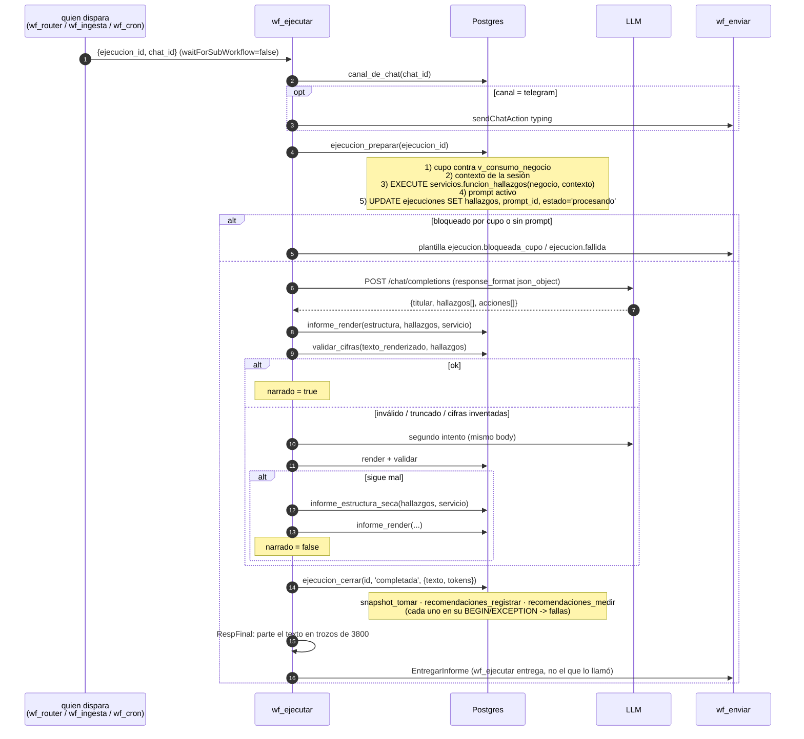

# Dominio: inteligencia (análisis, salud, informes)

De datos almacenados a un texto entregado en el chat.

## Responsabilidades

Calcular métricas y notas de salud, ejecutar las reglas, priorizar, armar el
JSON de hallazgos, pedirle al modelo que redacte, renderizar con las plantillas,
**auditar que no inventó cifras**, y cerrar dejando memoria.

## Entradas / salidas

| | |
|---|---|
| Entrada | `ejecuciones.id` en estado `preparando` |
| Salida | `ejecuciones.texto` + mensajes de chat + snapshot + recomendaciones + medición |
| Workflow | `wf_ejecutar` (29 nodos) · `bin/gen_wf_ejecutar.py` |
| Decisiones | `CORE-001`, `INFORME-001`, `HALLAZGOS-001`, `PRODUCTO-002` |

## Flujo `[CONFIRMADO]`



## `ejecucion_preparar` — el único punto donde se decide qué ve el modelo

`[CONFIRMADO]` Despacho dinámico:

```sql
SELECT funcion_hallazgos FROM servicios WHERE codigo = v_servicio;
IF to_regprocedure(format('%I(bigint,jsonb)', v_funcion)) IS NULL THEN … fallida
EXECUTE format('SELECT %I($1,$2)', v_funcion) INTO v_hallazgos USING negocio, contexto;
```

| Servicio | `funcion_hallazgos` | Qué produce |
|---|---|---|
| `ventas_compras` | `hallazgos_generar` | salud + 11 reglas priorizadas + comparativo + periodo + resumen + margen_bajo + deriva_costo + baja_cobertura + pareto |
| `mercado_compras` | `hallazgos_compras` | periodo + resumen + gasto_producto + deriva_costo + precio_disperso + proveedores + sin_venta |
| `consulta` | `contexto_negocio_recuperar` | pregunta + hechos (KB) + consulta resuelta + perfil + estado + comparativo + recomendaciones vigentes |

`[CONFIRMADO]` **Asimetría importante**: `hallazgos_compras` **no incluye la
clave `recomendaciones`**, ni `salud`, ni `encabezado`. Su prompt (`prompts` id
5) empieza con «Partí de la lista `recomendaciones`» y sólo después dice «Si
`recomendaciones` viene vacía, usá `deriva_costo`, `precio_disperso`,
`proveedores` y `sin_venta`». En la práctica **la rama de fallback es la única
que se ejecuta** para `mercado_compras`: sin impacto en pesos, sin prioridad y
sin bloque de salud. `[INFERIDO]` Es probable que el prompt se haya copiado de
`ventas_compras` sin ajustar; funciona, pero el servicio entrega un producto
distinto del que su prompt describe.

## Salud `[CONFIRMADO]`

`salud_negocio(negocio)` calcula seis notas 0–100 y devuelve `NULL` entera si
las seis son nulas.

| Nota | Fórmula | Devuelve NULL cuando |
|---|---|---|
| `ventas` | `50 + (ventas 2ª mitad − 1ª mitad) × 100 / 1ª mitad`, acotado a [0,100] | el periodo dura < 14 días o la 1ª mitad vendió 0 |
| `margenes` | % de productos con precio cuyo `margen_pct ≥ margen_minimo_pct` | no hay ningún producto con precio y margen |
| `inventario` | % de productos con `dias_cobertura` entre `dias_cobertura_min` y `rotacion_lenta_dias` | ningún producto tiene cobertura calculable |
| `compras` | % de productos con `deriva_pct < deriva_costo_alerta_pct` | no hay compras con costo |
| `riesgos` | `100 − (mayor proveedor % del gasto) + 20`, acotado | no hay compras con proveedor en `raw` |
| `liquidez` | `100 − (saldo vencido / saldo total × 100)` sobre facturas `tipo='venta'` con `saldo>0` | no hay ninguna factura de venta a crédito |

`indice = round(avg(notas no nulas))`. `HALLAZGOS-001` cumplido literalmente: no
hay relleno con valor neutro.

`[CONFIRMADO]` También devuelve `inventario_estimado: true|false` — si alguna
cobertura salió de stock estimado (`DATOS-001`).

Medido hoy sobre el negocio real: `{"indice":51,"ventas":57,"compras":100,
"riesgos":97,"margenes":2,"inventario":0,"inventario_estimado":true}`. Sin
`liquidez` (no hay facturas de venta, ver `ingestion.md`).

## El informe: qué calcula SQL y qué escribe el modelo

`[CONFIRMADO]` Reparto exacto:

| Pieza | Quién |
|---|---|
| Impacto en pesos, precio sugerido, cantidad a comprar, proveedor más barato | **SQL** (`recomendaciones_negocio`) |
| Textos `problema`, `impacto`, `opciones` de cada recomendación | **SQL**, ya redactados con `format()`, `miles()`, `fmt_decimal()` |
| Prioridad alta/media/baja y el orden | **SQL** |
| `titular`, y la reescritura de `problema`/`impacto`/`opciones` | **modelo** |
| Iconos permitidos | SQL los propone; `informe_render` valida contra una lista blanca de 10 y sustituye por `🔎` si no está |
| Layout HTML, cabecera de métricas, bloque de salud, bloque «sobre qué datos hablo» | **SQL** (`informe_render`, `informe_salud_bloque`, `informe_base_bloque`) |
| Troceado en mensajes de ≤3800 caracteres | **n8n** (JS) |

`[CONFIRMADO]` Por tanto el modelo **puede** empeorar la redacción pero **no
puede** cambiar una cifra sin que `validar_cifras` lo detecte, ni cambiar el
orden de prioridad sin que se note (el `prioridad` se le pide copiar).

## `validar_cifras` — cómo funciona de verdad

`[CONFIRMADO]`, `db/actual/funciones/validar_cifras.sql`:

1. Construye el conjunto **permitido** con dos extracciones sobre
   `p_hallazgos::text`:
   - `literal`: `\d+(?:\.\d+)?` normalizado con `cifra_norm` (JSON: punto
     decimal, sin miles).
   - `humano`: `\d[\d.,]*` expandido con `cifra_variantes` (formato colombiano,
     porque los hallazgos ya traen texto redactado por SQL).
2. Recorre el **texto renderizado** buscando `\d[\d.,]*`.
3. **Ignora cualquier número de menos de 3 dígitos** (un «3 productos» o un
   «80 %» no es una cifra copiada).
4. Marca `inventadas` las que no intersecan el permitido.

`[CONFIRMADO]` Se valida **después** de renderizar, sobre el texto que va a leer
el usuario, cabecera de métricas incluida. `INFORME-001` invariante 3 cumplido.

`[INFERIDO]` Limitación real: al extraer del `::text` completo del JSON de
hallazgos, cualquier número presente en cualquier parte del JSON —incluidos
`producto_id`, `negocio_id`, timestamps— queda permitido. El validador impide
inventar, no impide **recombinar**.

## Degradación

`[CONFIRMADO]` Tres caminos, ninguno deja al usuario sin respuesta:

| Situación | Resultado |
|---|---|
| El modelo responde bien | informe narrado |
| Truncado (`finish_reason='length'`), JSON no parseable, o cifra inventada | **un** reintento; si vuelve a fallar, informe seco |
| Fallo HTTP (429, timeout, sin cupo del proveedor) | `onError: continueRegularOutput` → `Extraer` no encuentra `choices` → `invalido=true` → mismo camino → informe seco |
| Cupo mensual de tokens superado | `ejecuciones.estado='bloqueada'`, plantilla `ejecucion.bloqueada_cupo`, **sin gastar tokens** |
| Servicio sin prompt activo o sin función de hallazgos | `ejecuciones.estado='fallida'`, plantilla `ejecucion.fallida` |
| Ejecución colgada > 15 min | reaper de `mantenimiento_ciclo` |

`[CONFIRMADO]` El informe seco pierde la narración, **no** el formato: usa
`informe_estructura_seca` + el mismo `informe_render`.

## Presupuesto de tiempo — medido

`[CONFIRMADO]`, contra el negocio real (65 productos, 37.454 movimientos):

| Etapa | Tiempo |
|---|---|
| `hallazgos_generar(55)` (dentro de `ejecucion_preparar`) | **95,6 s** |
| llamada al LLM | variable, `timeout` 120 s, hasta 2 intentos |
| `informe_render` + `validar_cifras` | no medido aisladamente |
| `ejecucion_cerrar` → `snapshot_tomar` + `recomendaciones_registrar` (que vuelve a llamar a `recomendaciones_negocio`, ~47 s) + `recomendaciones_medir` | ≳ 50 s |
| **Techo de la ejecución** | `EXECUTIONS_TIMEOUT = 300 s` |

`[INFERIDO]` El camino feliz cabe con poco margen; el camino con reintento del
LLM probablemente no. Coincide con el hallazgo A-02 y explica por qué en esta
instalación **hay 0 ejecuciones** pese a 96 documentos cargados y el botón
tocado.

## Informe periódico

`[CONFIRMADO]` `informes_periodicos_disparar()`, llamada desde
`mantenimiento_ciclo` cada 5 min:

- respeta `parametros.informe_periodico_activo` (true) y la franja horaria
  `alerta_hora_desde`/`_hasta` (8–20, zona `America/Bogota`);
- selecciona de `v_negocios_informe_periodico`: último análisis hace ≥
  `informe_periodico_dias` (30), ≥ `informe_periodico_min_movs` (10) movimientos
  nuevos, y **ninguna ejecución en vuelo**;
- crea sesión + ejecución, manda **primero** el aviso
  `informe.periodico_aviso` y después dispara `wf_ejecutar`.

## Ejecución de acciones recomendadas

`[CONFIRMADO]` Existe, pero es **registro, no ejecución sobre sistemas
externos**. Ver `recommendations.md` §Ejecución. Chasqui no cambia un precio en
un POS, no manda un pedido a un proveedor y no envía un cobro. `pedido_sugerido`
arma una lista de compra que se **mira** en el portal.
