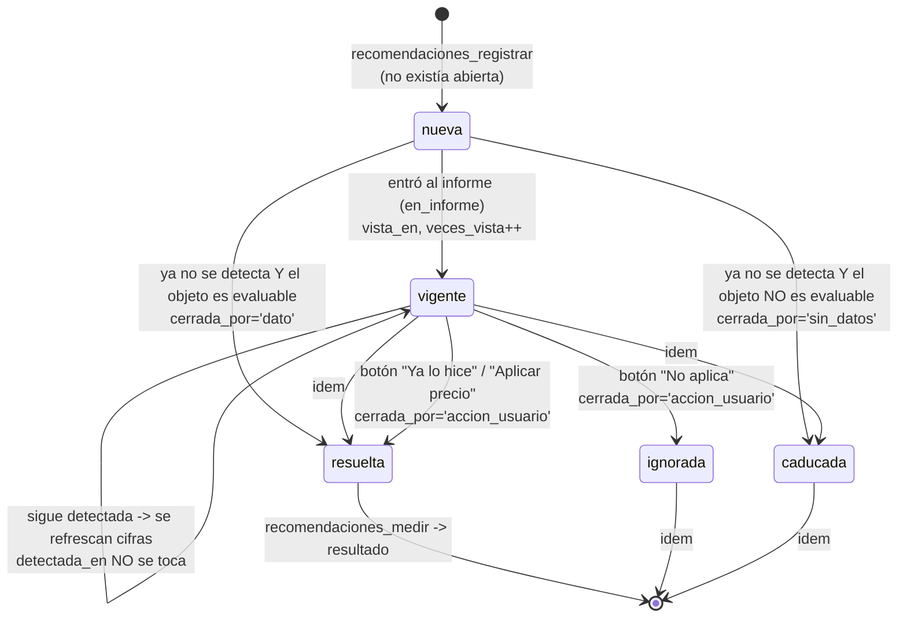

# Dominio: recomendaciones

Detectar → priorizar → mostrar → persistir → cerrar → medir.

## Responsabilidades

| | |
|---|---|
| Detección y prioridad | `recomendaciones_negocio(negocio, p_registro boolean DEFAULT false)` — 683 líneas, 11 reglas |
| Persistencia | `recomendaciones_registrar(negocio, ejecucion)` |
| Acción del usuario | `recomendacion_accion(id, negocio, accion, usuario)` desde el chat; `portal_recomendacion_accion(id, accion)` desde el portal |
| Cierre | `recomendacion_marcar_cierre(id)` graba `datos.valor_al_cerrar` |
| Medición | `recomendaciones_medir(negocio)` |
| Lectura | `recomendaciones_vigentes(negocio, limite)`, `portal_recomendaciones` |
| Derivado | `pedido_sugerido(negocio)` — la lista de compra |
| Tablas | `recomendaciones`, `metricas_resultado`, `parametros` |
| Decisiones | `CORE-003`, `CORE-001`, `DATOS-001` |

Las 11 reglas con sus umbrales y fórmulas están en `../business-rules.md`.

## Ciclo de vida `[CONFIRMADO]`



`[CONFIRMADO]` El CHECK `recomendaciones_check` obliga a que
`estado ∈ {nueva,vigente}` ⇔ `cerrada_en IS NULL`. El índice único parcial
`uq_recomendacion_abierta` garantiza una sola abierta por
`(negocio, regla, clave_objeto)`.

## Detectado vs. mostrado `[CONFIRMADO]`

```
priorizadas : todas las filas de las 11 reglas, con prioridad y relevancia
              + rn = row_number() por regla ordenado por impacto_mes DESC
visibles    : las que tienen rn <= 2, ordenadas por (prioridad, relevancia DESC)
salida      : p_registro = true  -> todas, con en_informe = (pos <= 8)
              p_registro = false -> sólo las que pos <= 8
```

Es decir: **máximo 2 por regla y 8 en total** en el informe; el registro ve
todo. La distinción existe (migración 059) para no cerrar como «resuelta» una
recomendación que sólo quedó fuera del top.

`[CONFIRMADO]` Medido hoy: `recomendaciones_negocio(55, true)` devuelve **123**
recomendaciones detectadas. De ellas, 8 llegarían al informe.

`[CONFIRMADO]` En modo informe el JSON **no** lleva `regla`, `clave_objeto`,
`datos` ni `en_informe`: el modelo no ve claves internas y `validar_cifras` no
tiene que dar por buenos ids internos.

## Prioridad `[CONFIRMADO]`

```
pct        = impacto_mes × 100 / base_mes
base_mes   = greatest(sum(ventas), sum(compras)) / meses, mínimo 1
umbral alta / media, POR TIPO DE IMPACTO:
    mensual  -> prioridad_alta_pct        = 2      prioridad_media_pct        = 0,5
    unico    -> prioridad_alta_unico_pct  = 10     prioridad_media_unico_pct  = 3
    capital  -> prioridad_alta_capital_pct= 50     prioridad_media_capital_pct= 20
prioridad  = alta si pct >= alta; media si pct >= media; si no, baja
relevancia = pct / max(media, 0.0001)          -- comparable entre tipos
Excepción: regla 'dependencia' entra fija en 'media' con relevancia 0.
```

## Persistencia — los cuatro pasos de `recomendaciones_registrar` `[CONFIRMADO]`

1. **Las que siguen**: `UPDATE` de todas las cifras y textos; `revisada_en=now()`.
   `detectada_en` **no** se toca — es «desde cuándo vengo así».
2. **Las nuevas**: `INSERT` con `ejecucion_id` = la corrida que las vio primero.
3. **Las que ya no están**: primero `recomendacion_marcar_cierre` (graba
   `datos.valor_al_cerrar`), después `UPDATE` a `resuelta` (`cerrada_por='dato'`)
   si `recomendacion_objeto_evaluable`, o `caducada` (`'sin_datos'`) si no.
4. **Las que llegaron al informe**: `estado='vigente'`, `vista_en` si estaba
   NULL, `veces_vista + 1`. **Sólo las del top 8.**

`[CONFIRMADO]` Se llama desde `ejecucion_cerrar`, sólo si el servicio tiene
`entrada='archivos'` y el estado es `completada`.

`[CONTRADICCIÓN]` Eso incluye a `mercado_compras`, cuyo `funcion_hallazgos` es
`hallazgos_compras` y **no produce recomendaciones**. `recomendaciones_registrar`
llama directamente a `recomendaciones_negocio` —las reglas de ventas— así que
una corrida de «Mercado de compras» registra recomendaciones que su propio
informe nunca mostró. `[INFERIDO]` No es incorrecto por sí mismo (la memoria del
negocio es una sola), pero un lector razonable esperaría que el informe y lo
registrado coincidieran.

## Acciones del usuario `[CONFIRMADO]`

Tres, con `callback_data` `rec:<accion>[:<id>]`, resueltas en
`router_h_comandos` → `recomendacion_accion`:

| Acción | Efecto |
|---|---|
| `hice` | `resuelta`, `cerrada_por='accion_usuario'` |
| `no_aplica` | `ignorada`, `cerrada_por='accion_usuario'` |
| `precio` | si `datos.precio_sugerido` existe y es > 0: `conocimiento_guardar(tipo='precio', clave=titulo, datos={valor,...})` y `resuelta`. Si no: error `sin_precio` |

Más `rec:list` (lista) y `rec:ver:<id>` (detalle), que no cierran nada.

`[CONFIRMADO]` `portal_recomendacion_accion` existe en paralelo con la misma
semántica, y `portal_pedido` expone `pedido_sugerido`.

## Medición del resultado `[CONFIRMADO]`

`recomendaciones_medir(negocio)`, llamada desde `ejecucion_cerrar` **después**
de registrar:

```
para cada recomendación cerrada, sin resultado, con datos.valor_al_cerrar:
    si NO hay movimientos con creado_en > cerrada_en   -> sin_datos, se salta
    valor_ahora = recomendacion_metrica_valor(negocio, clave_objeto, metrica, cerrada_en::date)
    delta = (ahora - antes) × 100 / |antes|      (si antes = 0: 0 o 100)
    resultado = neutro    si |delta| < metricas_resultado.umbral_pct
                positivo  si la dirección coincide
                negativo  si no
```

`[CONFIRMADO]` La métrica y la dirección salen de la tabla de contenido
`metricas_resultado` (11 filas, una por regla). Se usa `creado_en` y no `fecha`
a propósito: lo que importa es que haya entrado información nueva.

| regla | métrica | dirección | umbral % |
|---|---|---|---|
| `costo`, `proveedor`, `proveedor_sube` | `costo` | baja_mejor | 5 |
| `margen`, `margen_cae` | `margen_pct` | sube_mejor | 5 |
| `agota` | `balance` | sube_mejor | 10 |
| `quieto` | `balance` | baja_mejor | 10 |
| `sin_ventas` | `unidades_vendidas` | sube_mejor | 0 |
| `dependencia` | `concentracion_pct` | baja_mejor | 5 |
| `vs_ano_anterior` | `ventas` | sube_mejor | 5 |
| `cartera` | `saldo_vencido` | baja_mejor | 10 |

`[CONFIRMADO]` `metricas_resultado.regla` **no tiene FK** contra nada: si se
agrega una regla nueva sin su fila aquí, la recomendación simplemente nunca se
mide (el `JOIN` la deja fuera). Silencioso.

`[CONFIRMADO]` `CORE-003` se cumple: la recomendación sobrevive a la ejecución
que la produjo y el resultado se mide contra ella.

## Ejecución de acciones — qué existe realmente

`[CONFIRMADO]` **No existe ningún mecanismo que ejecute una acción sobre un
sistema externo.** Lo que hay:

| Pieza | Qué hace de verdad |
|---|---|
| `recomendacion_accion('precio')` | escribe un hecho en `conocimiento` con el precio sugerido. **No cambia ningún precio en ningún POS.** |
| `pedido_sugerido` / `portal_pedido` | arma una lista de compra (producto, unidades, proveedor más barato, costo) para **mirar**. No manda nada a nadie |
| `portal_pago_registrar` / `pago_registrar` | registra un pago que ya ocurrió; baja `facturas.saldo` |
| `portal_cotizacion_guardar` | genera una cotización con URL pública. Es un documento, no una transacción |
| `router_plan` | muestra un enlace de pago si `parametros.pago_enlace` existe para el negocio. **No hay webhook de Wompi ni cobro** |

`[INFERIDO]` El ciclo declarado en `AGENTS.md` es
«detectar → explicar → cuantificar → recomendar → ejecutar». Los cuatro primeros
están implementados. El quinto, en el sentido de actuar sobre el mundo, **no
existe**: lo que hay es registrar la decisión y medir su efecto en los datos que
lleguen después. Eso es suficiente para `CORE-003`, pero no es «ejecutar».

## Estado observado

`[CONFIRMADO]` `recomendaciones` tiene **0 filas** en esta instalación, porque
nunca se completó una ejecución. Las 123 que las reglas detectan hoy existen
sólo como resultado de una consulta, no como estado persistido. Y sin embargo
`alertas_evaluar` **sí** las está viendo y registrando en `alertas_enviadas`
(57 filas): la proactividad no depende de que haya habido un informe.
