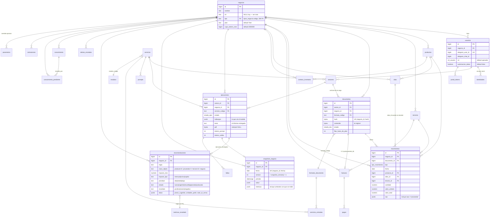

# Modelo de datos

Estado del catálogo vivo de Postgres el **2026-08-19**: 1 schema (`public`),
**34 tablas**, **22 vistas**, **160 funciones**, **1 trigger**, **6 tipos enum**.
Extraído con consultas a `pg_class`, `pg_attribute`, `pg_constraint`,
`pg_indexes`, `pg_trigger`, `pg_enum`. No hay más schemas propios del proyecto.

## 1. Cómo se dividen las 34 tablas

| Grupo | Tablas | Criterio mecánico |
|---|---|---|
| **Datos del negocio** (22) | `negocios` `usuarios` `identidades` `sesiones` `documentos` `movimientos` `productos` `alias` `terceros` `facturas` `pagos` `conteos_inventario` `cotizaciones` `ejecuciones` `snapshots_negocio` `recomendaciones` `alertas_enviadas` `conocimiento` `conocimiento_pendiente` `portal_tokens` `fallas` `schema_migraciones` | tienen columna de pertenencia (`negocio_id`, `usuario_id`, `sesion_id`) o son runtime |
| **Producto / contenido** (12) | `plantillas` `prompts` `prompts_tecnicos` `parametros` `servicios` `servicios_entradas` `modulos` `intenciones` `metricas_resultado` `formatos_documento` `sinonimos_columna` `tipos_negocio` | sin columna de pertenencia; se cambian por migración |

`[CONFIRMADO]` `parametros` es el caso híbrido: tiene `negocio_id` **nullable**
con dos índices únicos parciales (`uq_param_global` para `NULL`,
`uq_param_negocio` para el resto). Las 35 filas actuales son todas globales.

`[CONTRADICCIÓN]` `formatos_documento` es tabla de producto pero **guarda lo que
el sistema aprendió de un cliente**: hoy tiene 3 filas `origen='semilla'` y **2
filas `origen='inferido'`** (`tabular_20a6271e84`, `tabular_29ec2affe3`)
generadas por los archivos de la prueba de usuario. `bin/gen_estado_sql.sh` las
vuelca a `db/actual/contenido/formatos_documento.sql`, que por eso aparece
modificado en `git status`. `bin/verificar.sh` chequeo 8 protege `db/base/` pero
**no** `db/actual/`. Es el hallazgo A-13 de `agent-context/history/auditorias/2026-08-19/orden-de-trabajo.md`.

## 2. Tipos enum

`[CONFIRMADO]`

| Tipo | Valores | Usado en |
|---|---|---|
| `estado_doc` | `pendiente`, `parseado`, `error`, `descartado` | `documentos.estado` |
| `estado_ejec` | `preparando`, `procesando`, `validando`, `completada`, `fallida`, `bloqueada` | `ejecuciones.estado` |
| `estado_sesion` | `intake`, `recibiendo`, `procesando`, `completada`, `fallida`, `expirada` | `sesiones.estado` |
| `tipo_movimiento` | `compra`, `venta`, `ajuste` | `movimientos.tipo`, `facturas.tipo` |
| `origen_alias` | `exacto`, `trigram`, `manual`, `pendiente` | `alias.origen` |
| `rol_usuario` | `dueno`, `operador`, `admin` | `usuarios.rol` |

`[CONFIRMADO]` `estado_ejec` declara `validando` pero **ningún código lo
escribe**: `ejecucion_preparar` pone `procesando`, `ejecucion_cerrar` pone lo
que le pasen (siempre `completada`), el reaper pone `fallida`, y la falta de
cupo pone `bloqueada`. `validando` sólo aparece en los `WHERE ... IN (...)` del
reaper y del índice `idx_ejec_colgadas`. **Valor muerto.**

`[CONFIRMADO]` `tipo_movimiento.ajuste` tampoco se escribe en ninguna parte.
**Valor muerto.**

`[CONFIRMADO]` `rol_usuario.dueno` no lo asigna ninguna ruta de producción:
`usuario_de_canal` crea al usuario con el DEFAULT `operador`. `dueno` sólo lo
escriben los bancos de prueba (`aceptacion`, `empty_state`, `carga_sin_perdida`,
`ingesta_sin_modelo`, `router_casos`) y `bin/cargar_datos_prueba.py`. Y ningún
código **lee** `rol='dueno'`: el único rol con efecto es `admin`, comprobado en
`router_h_admin` y en el `SELECT` de `wf_error`. Subir a `admin` es un `UPDATE`
manual documentado en el README.

`[NO DETERMINADO]` / deuda conocida: `db/actual/` **no vuelca los tipos enum**
(`decisiones/deuda.md` D-010), así que la única definición versionada está en
`db/base/000_esquema.sql`, que ya quedó vieja: la migración 075 agregó
`descartado` y el baseline sigue diciendo tres valores.

## 3. Trigger

`[CONFIRMADO]` Uno solo en toda la base:

```
trg_movimientos_limite_plan  BEFORE INSERT ON movimientos  FOR EACH ROW
  -> movimientos_limite_plan()
```

No rechaza nada. Si la fila cae fuera de la ventana del plan, incrementa
`documentos.filas_fuera_de_plan` y **devuelve NEW igual**. Es la implementación
literal de `CORE-002` («ningún camino de escritura puede descartar filas por
plan»). El filtrado de lectura lo hace la vista `mov_visibles`.

## 4. ERD de las entidades principales



## 5. Tablas relevantes, una por una

### `negocios`
`[CONFIRMADO]` La raíz del aislamiento. `nit` es **crítico y hoy NULL**: sin él,
`cartera_facturar_dian` no puede decidir qué lado del mostrador es el negocio y
**toda factura DIAN se clasifica como `compra`**. Las plantillas tienen la
variable `aviso_nit` justamente para eso.
`tipo` referencia `tipos_negocio.codigo` **sin FK declarada**.

### `usuarios` / `identidades`
`[CONFIRMADO]` `usuarios` conserva columnas `telegram_*` de antes del soporte
multicanal; `identidades` es el modelo nuevo (`UNIQUE(canal, id_externo)`,
`datos jsonb` con `chat_id` y `username`). `usuario_de_canal` escribe en las dos
y crea negocio automáticamente si el usuario no tiene (`PLANES-001`).
`[INFERIDO]` Duplicación deliberada por compatibilidad; `chat_de_usuario` y
`carga_panel` leen `identidades` primero y caen a `usuarios.telegram_chat_id`.

### `sesiones`
`[CONFIRMADO]` El estado de la conversación. Además del enum lleva tres marcas
de tiempo que son el corazón del debounce: `analisis_pedido_en` (el usuario tocó
Analizar), `panel_pedido_en` (hay un panel en vuelo), `panel_mensaje_id` (el
mensaje que se edita). `contexto jsonb` guarda la pregunta de una consulta, el
origen `periodico`, y `descargas_fallidas[]`.

### `documentos`
`[CONFIRMADO]` **Fuente de verdad del archivo original.** `UNIQUE(negocio_id,
hash)` hace la ingesta idempotente: reenviar el mismo archivo hace `DO UPDATE
SET sesion_id`, no lo duplica. `estado='descartado'` (migración 075) es para el
archivo que se entendió pero no se carga a propósito — un resumen agregado.
`motivo_pendiente` existe en el esquema pero **ninguna función lo escribe**
`[CONFIRMADO]` por búsqueda en las 160 definiciones.

### `movimientos`
`[CONFIRMADO]` La tabla grande (37.454 filas hoy). `raw jsonb` conserva la fila
original más las claves canónicas resueltas. **El proveedor no tiene tabla**:
vive en `raw->>'proveedor'` y todas las reglas lo leen de ahí con
`nullif(btrim(...),'')`. `tercero_id` sólo se llena por la ruta DIAN
(`cartera_facturar_dian` hace `UPDATE movimientos SET tercero_id`, `tipo`).
`[INFERIDO]` Hay por tanto **dos identidades de proveedor** conviviendo: texto
libre en `raw` (lo que usan las reglas) y `terceros` (lo que usa la cartera).

### `productos` / `alias`
`[CONFIRMADO]` `productos` se **crea sola** durante el matching cuando hay
código de barras. `alias` memoriza cada texto normalizado visto; con
`producto_id IS NULL` es un pendiente que el portal resuelve. `idx_alias_texto_trgm`
(GIN trigram) sostiene la búsqueda por parecido.

### `facturas` / `pagos` / `terceros`
`[CONFIRMADO]` `facturas` es 1:1 con `documentos` (`UNIQUE(documento_id)`) y su
`saldo` se preserva al refacturar: `saldo = EXCLUDED.total - (total - saldo)`.
`pagos` lo baja vía `pago_registrar`. Sólo las facturas `tipo='venta'` con
`saldo>0` alimentan la nota de liquidez y la regla `cartera`.

### `conteos_inventario`
`[CONFIRMADO]` Lo único que el dueño **declara** sobre stock. `UNIQUE(negocio_id,
producto_id, fecha)`, `origen ∈ {portal, archivo, chat}`. Es lo que convierte
`v_balance_unidades.origen_stock` de `estimado` a `conteo`/`calculado`
(`DATOS-001`).

### `ejecuciones`
`[CONFIRMADO]` Una fila por análisis. `hallazgos` es el **snapshot exacto de lo
que vio el modelo** y es contra lo que `validar_cifras` audita el texto.
`texto` es el informe entregado. `pdf` está siempre en NULL.
`tokens_*` y `costo` alimentan `v_consumo_negocio` y el control de cupo.

### `snapshots_negocio`
`[CONFIRMADO]` La memoria del estado. Uno por negocio y **día**
(`uq_snapshot_dia`), con `ON CONFLICT DO UPDATE`: dos análisis el mismo día
pisan el snapshot, no lo acumulan. Guarda margen y cobertura de **todos** los
productos (no sólo los que disparan regla), `precios_proveedor`, `calidad` del
matching y los `umbrales` con los que se midió.

### `recomendaciones`
`[CONFIRMADO]` `uq_recomendacion_abierta` es un índice único **parcial** sobre
`(negocio_id, regla, clave_objeto) WHERE estado IN ('nueva','vigente')`: sólo
puede haber una abierta por objeto, pero el histórico cerrado se acumula sin
límite. El CHECK `recomendaciones_check` impone que `estado ∈ {nueva,vigente}`
sea exactamente equivalente a `cerrada_en IS NULL`.

### `alertas_enviadas`
`[CONFIRMADO]` Sólo registro de cooldown: `(negocio_id, regla, clave_objeto,
enviada_en)`. No guarda si el mensaje llegó. Hoy tiene 57 filas y **ninguna
llegó** (canal caído).

### `conocimiento` / `conocimiento_pendiente`
`[CONFIRMADO]` `conocimiento` es lo único que el dueño escribe a mano
(`/saber` en el chat, o el portal). `uq_conocimiento_clave` permite upsert por
`(negocio, tipo, clave)`. Índice GIN trigram sobre
`norm_texto(titulo||' '||contenido)`. `conocimiento_pendiente` registra las
preguntas que Chasqui no supo responder, con contador `veces`.

### `portal_tokens`
`[CONFIRMADO]` Guarda `digest(token,'sha256')`, nunca el token. Un token nuevo
invalida los anteriores del mismo usuario. Vida 15 min por defecto, un solo uso.

### `fallas`
`[CONFIRMADO]` La bitácora técnica. La escriben `wf_error`, `mantenimiento_ciclo`
(en sus `EXCEPTION`) y `ejecucion_cerrar` (si falla snapshot/recomendaciones).

## 6. Índices que importan

| Índice | Para qué |
|---|---|
| `idx_mov_negocio_fecha`, `idx_mov_producto`, `idx_mov_tercero`, `idx_mov_documento` | recorridos de `mov_visibles` |
| `idx_alias_texto_trgm` (GIN), `idx_productos_nombre_trgm` (GIN) | matching por parecido |
| `idx_conocimiento_texto_trgm` (GIN, sobre expresión) | `conocimiento_buscar` |
| `uq_formato_huella` | una huella de cabeceras = un formato |
| `uq_recomendacion_abierta` | una recomendación abierta por objeto |
| `uq_snapshot_dia` | un snapshot por día |
| `idx_ejec_colgadas` (parcial) | reaper de `mantenimiento_ciclo` |
| `idx_facturas_abiertas` (parcial `saldo>0`) | cartera |
| `uq_prompt_activo` (parcial `WHERE activo`) | un solo prompt activo por servicio |
| `idx_terceros_nombre` (único sobre `norm_texto(nombre)` cuando `nit IS NULL`) | dedup de proveedores sin NIT |

`[CONFIRMADO]` La lentitud del análisis **no** es falta de índice: es el volumen
de trabajo por consulta. Ver §7.

## 7. Rendimiento medido

`[CONFIRMADO]` Ejecutado contra el negocio real (65 productos, 37.454
movimientos) el 2026-08-19:

| Llamada | Tiempo | Salida |
|---|---|---|
| `salud_negocio(55)` | **26,9 s** | `{"indice":51,"ventas":57,"compras":100,"riesgos":97,"margenes":2,"inventario":0,...}` |
| `recomendaciones_negocio(55, true)` | **47,2 s** | 123 recomendaciones detectadas |
| `hallazgos_generar(55)` | **95,6 s** | 22.175 bytes de JSON |

`[INFERIDO]` `hallazgos_generar` ≈ suma de sus partes porque
`hallazgos_comparativo` vuelve a llamar a `salud_negocio` (no hay cache). Con
`EXECUTIONS_TIMEOUT = 300 s` para toda la ejecución de `wf_ejecutar`
—preparar + LLM + render + validar + posible reintento + cerrar (que dispara
snapshot, registro y medición)— el presupuesto está al límite. Es el hallazgo
A-02 de `agent-context/history/auditorias/2026-08-19/orden-de-trabajo.md`, aquí cuantificado.

## 8. Vistas

Las 22 vistas están en `db/actual/vistas/`. Las que sostienen el producto:

| Vista | Qué es | Nota |
|---|---|---|
| `mov_visibles` | `movimientos` filtrado por `plan_desde(negocio_id)` | **toda lectura analítica pasa por aquí**, nunca por `movimientos` |
| `v_costo_actual_producto` | último `valor_unitario` de compra | `DISTINCT ON` por fecha DESC |
| `v_precio_actual_producto` | último `valor_unitario` de venta | idem |
| `v_margen_producto` | costo, precio, margen % | base de las reglas `margen`, `costo`, `margen_cae` |
| `v_balance_unidades` | stock y **su origen** (`conteo`/`calculado`/`estimado`) | `DATOS-001` |
| `v_rotacion_producto` | unidades/día y `dias_cobertura` | reglas `agota`, `quieto` |
| `v_deriva_costo` | primer vs último costo de compra | regla `costo` |
| `v_pareto_utilidad` | concentración de utilidad | informe |
| `v_calidad_matching` | cuánta plata quedó sin producto | `/matching`, snapshot |
| `v_consumo_negocio` | tokens y costo del mes | control de cupo |
| `v_negocios_alertables` | negocios con dato nuevo desde el último análisis | `alertas_evaluar` |
| `v_negocios_informe_periodico` | negocios con ≥30 días y ≥10 movimientos nuevos | `informes_periodicos_disparar` |
| `v_cartera_edades`, `v_cartera_tercero` | aging | portal, regla `cartera` |
| `v_salud_ingesta`, `v_embudo_servicios`, `v_ejecuciones_fallidas`, `v_sesiones_atascadas` | diagnóstico | comandos de admin |
| `v_conocimiento_cobertura`, `v_conocimiento_faltante` | KB | portal |
| `v_perfil_negocio` | perfil agregado | `perfil_negocio()` |
| `v_proveedor_mas_barato` | par (producto, proveedor) más barato | `pedido_sugerido` |

`[CONFIRMADO]` `v_margen_producto` **no distingue unidad de compra de unidad de
venta**. Con `productos.unidad` como campo único, si el negocio compra por caja
y vende por unidad, `margen_pct` sale absurdo. Medido hoy: `margenes = 2` sobre
100 en la nota de salud. Es el hallazgo A-11.

## 9. Qué es fuente de verdad y qué es derivado

| Categoría | Qué |
|---|---|
| **Fuente de verdad** | `documentos.contenido` (el archivo), `conteos_inventario`, `conocimiento`, `pagos`, `sesiones`, las 12 tablas de contenido, `recomendaciones.estado`/`cerrada_por`/`resultado` |
| **Derivado, reconstruible** | `movimientos`, `productos`, `alias`, `terceros`, `facturas` (todo sale de reprocesar `documentos`) |
| **Derivado, NO reconstruible** | `snapshots_negocio` (foto de un instante con sus umbrales), `ejecuciones.hallazgos`/`texto`, `alertas_enviadas` |
| **Cache** | `formatos_documento` filas `origen='inferido'` — se pueden borrar y el sistema vuelve a aprender (a costa de llamadas al modelo). `bin/limpiar_negocio.sh --conservar-formatos` existe justo por eso |
| **Efímero** | `portal_tokens` (15 min), `fallas` (sin poda automática), ejecuciones de n8n (168 h, sólo errores) |
